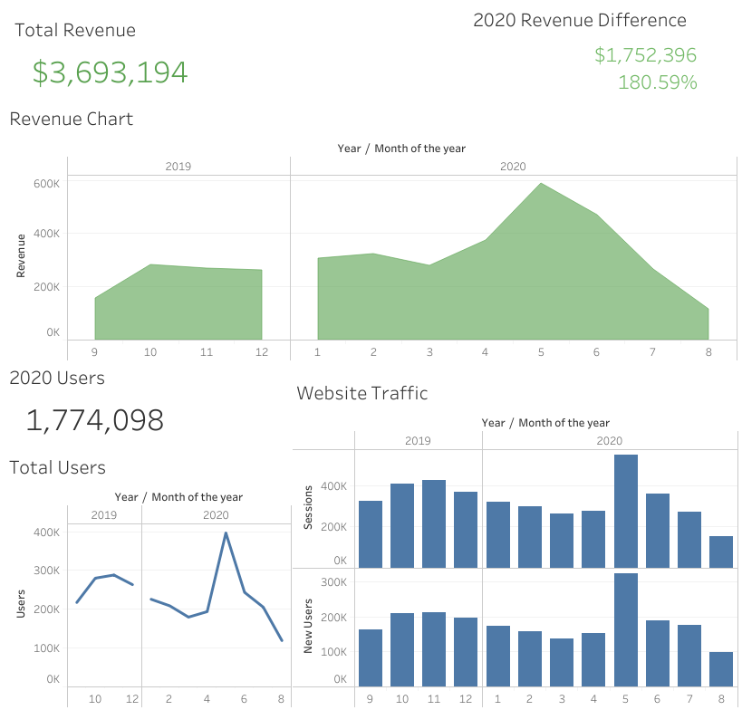

# Web_Analytics_ETL  
A short self-guided project to display the ETL process from CSV data to database storage to visualization.   
  
#### Web-Analytics Dataset   
https://www.kaggle.com/datasets/afranur/web-analytics-dataset/
  
## Project Steps  
### Setting Project Scope & Data Source  
I found my data source using Kaggle in the link provided above. The data contains website analytics including monthly user count, session duration, and conversion information. The data seems to have already been cleaned.   
#### Questions to Answer  
Created the below questions that are commonly asked regarding the data available:  
* How many users visited the website in 2020?  
* Which months had the highest/lowest number of visitors?  
* What is the trend in website traffic?  
* What is the trend in revenue growth  
* How much revenue was earned in 2020?  
* How much more/less revenue was earned from 2019 to 2020? ($ and %)  
* Which month had the highest conversion rate?  
  
### Transform Data
Code can be found in CSVToDatabase.py
Loaded the data in a Python environment within Visual Studio Code. Connected SQLite3 as it is small and personal after extracting and transforming data in Python.

### Create Visualization  
Created a visualization that answers the questions for this project.  
https://public.tableau.com/app/profile/andy.mauvais/viz/WebsiteAnalytics_ETL/2019-2020Web_Analytics  
  
  
#### Insights
**For this data, please note that 2019 is missing data for earlier months.**  
* How many users visited the website in 2020?  
  * 1,774,098 users visited the site in 2020.
* What is the trend in website traffic?  
	* The month of May seems to have been the best month for the website in terms of website traffic, new users, and revenue.  
* What is the trend in revenue growth?  
	* There was growth from March 2020 to May 2020, but revenue declined lower each subsequent month.
* How much revenue was earned in 2020?  
	* $3,693,194 dollars was earned in 2020.  
* How much more/less revenue was earned from 2019 to 2020? ($ and %)  
	* $1.75M at a 180% increase.
  
